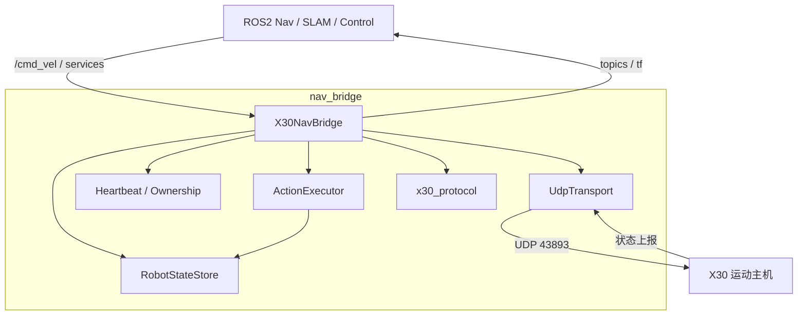
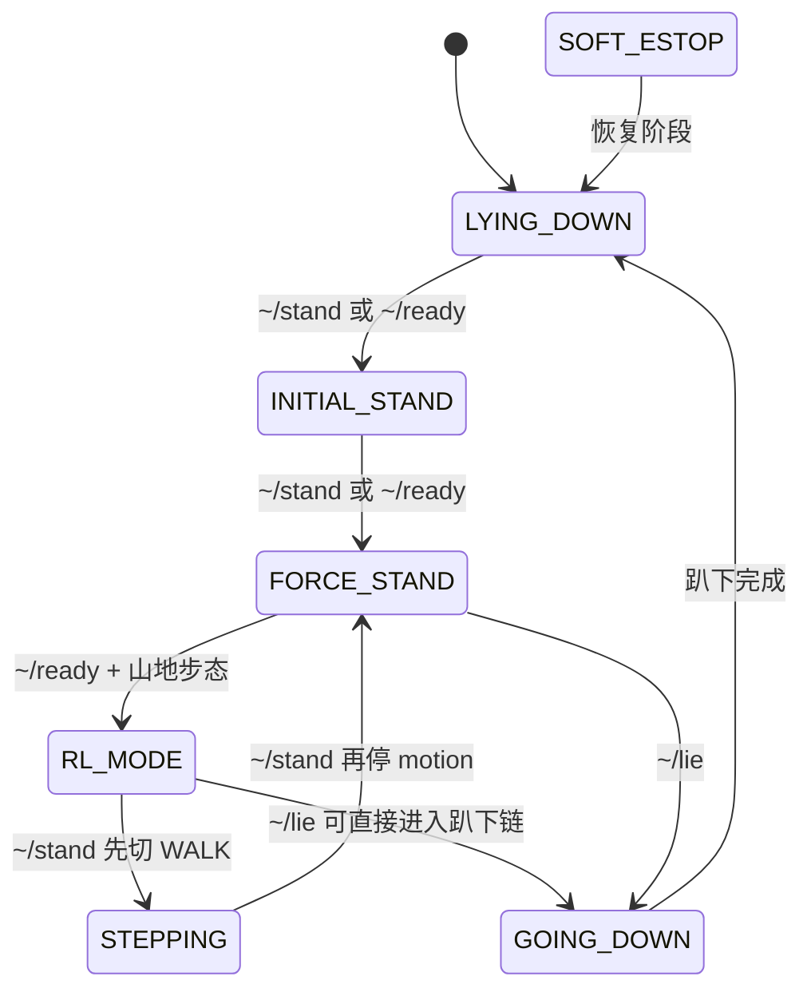

# Nav Bridge — ROS2 ↔ 绝影 X30 UDP 导航桥接节点

`nav_bridge` 是一个基于 C++ 的 ROS2 节点，用来把上层导航系统的标准接口桥接到绝影 X30 的 UDP 控制协议上。

它主要完成两件事：

1. 把 ROS2 的 `/cmd_vel` 与动作服务转换成 X30 底层可识别的 UDP 控制报文
2. 把机器人底层回传的高频状态、IMU、电池和足式里程计转换为标准 ROS2 话题

当前实现基于 **《绝影X30接口规格书（对外）ros+udp V1.0.5.pdf》** 中的 X30 UDP 接口规格，并针对实际控制接管时序做了额外的业务封装。

## 1. 系统架构

本项目现在不是一个“大类包办所有事情”的实现，而是按职责拆成了几层：

1. **网络层：`UdpTransport`**
   - 纯 Linux UDP socket 封装
   - 负责打开端口、发送报文、带超时接收
   - 不依赖 ROS2

2. **协议层：`x30_protocol.hpp`**
   - 定义 X30 指令码、状态枚举、结构体和速度映射工具
   - 包含 `CommandHead`、`RcsData`、`MotionStateData`、`ControllerSensorData`、`BatterySensorData`
   - 包含各步态的速度上限表

3. **状态仓库：`RobotStateStore`**
   - 统一保存当前连接状态、基本状态、步态状态
   - 提供基于 `condition_variable` 的状态等待能力
   - 替代旧版本里 scattered 的原子变量和轮询等待

4. **控制权层：`X30NavBridge` 内部 heartbeat ownership**
   - 控制权由节点内部显式持有
   - heartbeat 与 query 由统一控制定时器直接管理
   - 只会在 `~/release_control` 时显式释放，不再按 `/cmd_vel` 超时自动停心跳

5. **动作执行层：`ActionExecutor`**
   - 封装 `stand`、`lie`、`ready`
   - 负责冷启动接管预热、必要时的重复发令、状态等待和超时判定
   - 是当前所有动作业务逻辑的核心

6. **ROS 装配层：`X30NavBridge`**
   - 创建 ROS2 订阅、发布器、服务
   - 启动接收线程和控制定时器
   - 将底层状态转换为 ROS2 消息
   - 自己不再承担大段动作状态机逻辑



## 2. 核心控制逻辑

### 2.1 控制接管

X30 并不是“发一条动作指令就一定立刻执行”的设备。对于长时间静默后第一次发指令的场景，必须先建立稳定的控制会话。

当前实现中的控制接管逻辑如下：

- 控制权由 `X30NavBridge` 内部显式持有
- 持有控制权期间，统一控制定时器会持续发送：
  - `CMD_HEARTBEAT` (`0x21040001`)
  - 首次接管时附带 `CMD_QUERY_103` (`0x21020001`)
- `/cmd_vel` 和动作服务共享同一份 ownership
- `/cmd_vel` 超时后只会归零速度，不会自动释放控制权
- 只有调用 `~/release_control` 才会停止心跳并释放控制权

### 2.2 统一接管预热

当前实现不再区分“冷启动接管”和“热会话接管”两套策略，而是统一采用一个较短的控制预热窗口：

- 动作服务发关键指令前，会先做一次 heartbeat/query 预热
- 预热结束后再发送对应控制命令
- 这样可以在不引入复杂冷热状态机的情况下，保持服务调用的稳定性

### 2.3 持续接管窗口

当前代码中，`ready` 的起立步骤以及 `lie` 中的关键阶段不再简单依赖“一次发令 + 一次等待”。

对于 `CMD_STAND_UP_DOWN`、`CMD_MOTION` 这类 toggle 型命令，系统会进入一个**持续接管窗口**：

- 先做接管预热
- 发送一次控制命令
- 在一个总超时窗口内持续保活
- 若长时间仍无目标状态变化，则按固定间隔重发命令
- 直到出现目标状态或整体超时

这个机制的作用不是抽象所有命令，而是针对容易受时序影响的 toggle 型阶段做保守重试。

## 3. 主要服务语义

### 3.1 `~/ready`

`ready` 是当前最核心的业务服务，用于把机器人从静态或异常态拉到可导航工作态。

当前实现的目标不是“机械地执行固定脚本”，而是把机器人**收敛到 `RL_MODE + MOUNTAIN`**。  
在当前代码和实机表现下，主要流程通常是：

1. 如果在 `SOFT_ESTOP`，先恢复到 `LYING_DOWN`
2. 若在 `LYING_DOWN / GOING_DOWN`，执行起立
3. 若起立后处于 `INITIAL_STAND`，切入力控站立
4. 切换山地步态 `CMD_GAIT_MOUNTAIN`
5. 等待进入 `RL_MODE + MOUNTAIN`

需要注意的是：

- `ready` 内部仍然保留了针对 toggle 型命令的接管预热和重试逻辑
- 若底层状态反馈比预期更慢，服务会按当前状态继续等待或重试，而不是假定机器人一定线性流转
- 文档中描述的是当前代码下的主路径，真正行为仍以实机状态反馈为准

成功后，机器人应当处于：

- 基本状态：`RL_MODE`
- 步态状态：`MOUNTAIN`

此时可以接受 `/cmd_vel` 导航速度输入。

### 3.2 `~/stand`

将机器人收敛到**静止、可控、力控站立态**。

当前实现不是简单“发一个站立命令”，而是按当前状态把机器人收敛到 `FORCE_STAND`。  
根据当前实机验证，`RL_MODE` 到 `FORCE_STAND` 的路径并不是一步完成，而是：

`RL_MODE -> CMD_GAIT_WALK -> WALK/STEPPING -> CMD_MOTION -> FORCE_STAND`

所以当前逻辑会：

- 若已经处于 `FORCE_STAND`，直接返回成功
- 若处于软急停，先恢复到趴下
- 若处于趴下或正在趴下，先执行起立流程
- 若处于 `RL_MODE`，先发送 `CMD_GAIT_WALK`，等待步态进入 `WALK`，再等待基本状态进入 `STEPPING`
- 若处于 `STEPPING`，再发送 `CMD_MOTION` 停止运动
- 若处于 `INITIAL_STAND`，再补一次力控模式切换
- 最终目标状态是 `FORCE_STAND`

这里最重要的一点是：

- `CMD_GAIT_WALK` 本身并不直接等价于“静止站立”
- 当前代码是按实机观察到的状态机实现这条链路，而不是单纯按协议图静态推导

### 3.3 `~/lie`

让机器人安全回到趴下状态。

当前实现同样是“目标态收敛”，不是一条固定长度的命令链。  
它会根据机器人从运动态退出后实际落到哪个状态，决定是否继续补发趴下命令。

当前策略按业务场景分段处理：

- 若已经趴下，直接成功
- 若正在趴下，只等待最终进入 `LYING_DOWN`
- 若处于软急停，先恢复趴下
- 若处于 `RL_MODE`，先发送一次 `CMD_STAND_UP_DOWN` 退出 RL
- 若退出后或调用时仍处于 `STEPPING`，先发送 `CMD_MOTION` 停止运动并回到站立态
- 如果已经进入 `GOING_DOWN / LYING_DOWN`，则直接等待最终趴下
- 如果退出运动态后落在 `FORCE_STAND / INITIAL_STAND`，会先等待站立态稳定
- 只有在站立态稳定后，才补发 `CMD_STAND_UP_DOWN` 进入最终趴下阶段

`lie` 当前也复用了持续接管窗口，以提高首次接管或刚释放控制权后再次服务调用的稳定性。

### 3.4 `~/set_gait`

用于在踏步状态（`STEPPING`）或 RL 模式（`RL_MODE`）下切换步态模型。

> **注意：** 切换到 RL 类步态（`L_WALK`/`MOUNTAIN`/`SILENT`）后，机器人将进入 `RL_MODE`；
> 切换到普通步态（`WALK`/`SLOPE`/`OBSTACLE`/`STAIR*`）后，机器人处于 `STEPPING` 状态。
> 两种情况下均支持 `/cmd_vel` 速度转发。

接口类型已更改为 ROS2 标准 `rcl_interfaces/srv/SetParameters`，通过设置参数名 `gait` 来指定目标步态。

支持全部 10 种步态：

| 整数值 | 字符串名称 | 步态 |
| --- | --- | --- |
| `0` | `WALK` | 行走 |
| `1` | `OBSTACLE` | 越障 |
| `2` | `SLOPE` | 斜坡 |
| `3` | `RUN` | 跑步 |
| `6` | `STAIR_SOLID` | 楼梯（实心/镂空/无踢面） |
| `7` | `STAIR_ACC` | 楼梯（累积帧） |
| `8` | `STAIR45_ACC` | 45°楼梯（累积帧） |
| `32` | `L_WALK` | L 行走 |
| `33` | `MOUNTAIN` | 山地 |
| `34` | `SILENT` | 静音 |

调用示例：

```bash
# 整数方式切换到山地步态 (MOUNTAIN=33, type=2 表示 INTEGER)
ros2 service call /nav_bridge_node/set_gait rcl_interfaces/srv/SetParameters \
  "{parameters: [{name: 'gait', value: {type: 2, integer_value: 33}}]}"

# 字符串方式切换到楼梯步态 (不区分大小写, type=4 表示 STRING)
ros2 service call /nav_bridge_node/set_gait rcl_interfaces/srv/SetParameters \
  "{parameters: [{name: 'gait', value: {type: 4, string_value: 'STAIR_SOLID'}}]}"
```

服务执行时会：

1. 解析 `gait` 参数（整数值或字符串值）
2. 检查当前是否处于 `RL_MODE` 或 `STEPPING`
3. 做一次控制接管预热
4. 发送目标步态控制指令
5. 等待 `/robot_gait_state` 进入目标步态
6. 等待机器人进入允许 `/cmd_vel` 转发的状态（`STEPPING` 或 `RL_MODE`）

这样可以保证"切步态后仍可继续导航发速度"，同时以结构化参数报文替代裸数字透传。


## 4. `/cmd_vel` 速度控制

`/cmd_vel` 并不会直接在回调里发 UDP，而是走统一控制定时器。

数据流如下：

1. `cmdVelCallback()` 缓存最新的 `vx / vy / vyaw`
2. `onControlInputUpdated()` 记录新的速度输入时间
3. 统一控制定时器按固定频率运行
4. 若当前持有控制权：
   - 发送心跳和连接确认查询
   - 只有当前处于允许导航速度转发的状态窗口时，才会发送 `/cmd_vel` 对应 UDP 轴指令
   - 若 `/cmd_vel` 仍在保鲜时间内，则将速度映射为轴值并发送三条轴控制指令
   - 若 `/cmd_vel` 已超时，则持续发送零速度
5. 只有收到 `~/release_control`：
   - 才停止心跳
   - 释放控制权

当前允许 `/cmd_vel` 转发的状态窗口为（与手册 1.2.3.2 一致）：

- `STEPPING + 任意受支持步态`（WALK/OBSTACLE/SLOPE/RUN/STAIR*/L_WALK/MOUNTAIN/SILENT）
- `RL_MODE + RL 类步态`（L_WALK/MOUNTAIN/SILENT）

同时，在以下服务执行期间会临时暂停 `/cmd_vel` UDP 转发，以避免动作控制链和速度控制链互相打架：

- `~/ready`
- `~/stand`
- `~/lie`
- `~/set_gait`

### 4.1 速度映射

当前速度映射基于 `x30_protocol.hpp` 中的步态速度上限表：

- 前进速度：依据当前步态的 `max_forward / max_backward`
- 侧移速度：依据 `max_lateral`
- 角速度：依据 `max_yaw`

之后通过 `velocityToAxisValue()` 映射到 `[-32767, 32767]`。

额外处理：

- 速度超限时自动限幅
- 小于底层死区阈值时强制归零
- 侧移和偏航会根据 ROS 坐标系与 X30 遥杆定义差异进行符号变换

## 5. 上行数据解析

当前节点在后台启动一个接收线程 `receiveLoop()`，持续从运动主机接收状态上报。

主要处理以下报文：

- **`0x1008 RcsData`**
  - 机器人运行状态
  - 用于日志打印和错误告警
  - 首次收到时打印机器人名称、控制模式、累计里程与运行时间

- **`0x1009 MotionStateData`**
  - 当前最关键的状态反馈
  - 更新 `RobotStateStore`
  - 更新内部 `RobotState`
  - 发布 `/robot_basic_state` 与 `/robot_gait_state`
  - 发布 `/leg_odom`
  - 可选发布 `odom -> base_link` TF

- **`0x100A ControllerSensorData`**
  - 解析 IMU 欧拉角、角速度、加速度
  - 转换为标准 `sensor_msgs/Imu`
  - 发布 `/imu/data`

- **`0x21050F0A BatterySensorData`**
  - 发布电池电量百分比 `/battery/level`

## 6. ROS2 接口

### 6.1 订阅的话题

- `/cmd_vel` (`geometry_msgs/msg/Twist`)
  - 标准速度控制接口

### 6.2 发布的话题

- `/imu/data` (`sensor_msgs/msg/Imu`)
- `/leg_odom` (`nav_msgs/msg/Odometry`)
- `/robot_basic_state` (`std_msgs/msg/Int32`)
- `/robot_gait_state` (`std_msgs/msg/Int32`)
- `/battery/level` (`std_msgs/msg/UInt8`)

### 6.3 提供的服务

- `~/stand` (`std_srvs/srv/Trigger`)
- `~/lie` (`std_srvs/srv/Trigger`)
- `~/ready` (`std_srvs/srv/Trigger`)
- `~/release_control` (`std_srvs/srv/Trigger`)
- `~/set_gait` (`rcl_interfaces/srv/SetParameters`)

说明：

- 当前业务上只保留三个目标态服务：`lie / stand / ready`
- `~/release_control` 用于显式停止 heartbeat 并交还控制权
- `~/set_gait` 用于步态切换，支持全部 10 种步态（整数或字符串方式），参数名 `gait`
- 旧版本里存在的 `motion` 与 `force_stand` 对外服务链路已移除
- `ready` 进入山地步态后，机器人会根据底层状态机进入 `RL_MODE`

## 7. 配置参数

默认参数位于 `config/x30_params.yaml`。

主要参数包括：

- `motion_host_ip`
- `motion_host_port`
- `local_recv_port`
- `heartbeat_interval_ms`
- `cmd_vel_rate_hz`
- `cmd_vel_timeout_ms`
- `startup_acquire_control`
- `imu_frame_id`
- `odom_frame_id`
- `base_frame_id`
- `publish_tf`

## 8. 编译与运行

```bash
colcon build --packages-select nav_bridge --cmake-args -DCMAKE_BUILD_TYPE=Release -Wno-dev -DCMAKE_EXPORT_COMPILE_COMMANDS=1 --symlink-install

source install/setup.bash

ros2 launch nav_bridge nav_bridge.launch.py
```

## 9. 目录结构

```text
nav_bridge/
├── CMakeLists.txt
├── package.xml
├── README.md
├── config/
│   └── x30_params.yaml                    # 默认运行参数
├── launch/
│   └── nav_bridge.launch.py               # 启动 nav_bridge_node 并加载参数
├── srv/
│   └── ChargeCommand.srv                  # 自主充电控制服务定义
├── include/nav_bridge/
│   ├── action_executor.hpp                # 动作执行器接口，封装 stand/lie/ready 业务流程
│   ├── nav_bridge_base.hpp                # 桥接节点抽象基类与通用 ROS 接口定义
│   ├── robot_state_store.hpp              # 机器人状态缓存与条件变量等待接口
│   ├── udp_transport.hpp                  # UDP 传输封装接口
│   ├── x30_nav_bridge.hpp                 # X30 桥接节点类定义
│   └── x30_protocol.hpp                   # X30 协议常量、状态枚举、报文结构与工具函数
└── src/
    ├── action_executor.cpp                # 动作执行器实现
    ├── nav_bridge_node.cpp                # ROS2 节点入口
    ├── udp_transport.cpp                  # UDP 传输封装实现
    └── x30_nav_bridge.cpp                 # X30 桥接节点主实现
```

## 10. 实现特性

当前实现的主要工程特性如下：

- 状态等待已改为事件驱动，而不是显式轮询 sleep
- 心跳与速度发送统一到同一个控制时基
- heartbeat ownership 已并回 `X30NavBridge`，不再通过独立 session manager 管理
- 动作状态机从节点类中拆出，集中到 `ActionExecutor`
- 控制预热与动作逻辑已收敛，不再保留冷热接管两套显式状态
- `README` 以当前代码为准，不再描述已经删除或废弃的旧行为

## 11. 服务状态流转

下面这张图描述的是当前最常用的几个服务在业务层面的主要状态流转。



如果按 `ready` 的完整顺序理解，可以简化为：

`SOFT_ESTOP/LYING_DOWN -> INITIAL_STAND -> FORCE_STAND -> RL_MODE + MOUNTAIN`

如果按 `lie` 的完整顺序理解，可以简化为：

`RL_MODE/STEPPING -> (退出运动态) -> GOING_DOWN/LYING_DOWN`

## 12. 运行与调试建议

当前实现已经能在实机上工作，但从控制时序角度，仍然建议按下面的方式调试和使用：

- 第一次上电或节点刚启动后，如果启用了 `startup_acquire_control`，节点会立即持有控制权
- 如果刚释放控制权又立刻调用动作服务，允许系统先完成接管预热，不要连续高频猛点服务
- `~/stand` 的目标不是“仅仅站起来”，而是最终进入 `FORCE_STAND`
- `~/stand` 从 `RL_MODE` 收敛时，会先切 `WALK`，等待进入 `STEPPING`，再停止 motion
- `~/lie` 在 `RL_MODE` 下不简单复用 `stand` 的停止运动逻辑，而是优先进入“趴下链”
- 如果启动时已接管控制权，`/cmd_vel` 长时间静默只会归零速度，不会自动释放控制权
- 若日志中看到“保持接管并继续重发命令”，说明系统正在处理 toggle 型命令阶段的保守重试，不一定代表逻辑故障
- 若协议图、手册描述与当前实机行为不一致，排查时应优先以当前状态反馈和实测路径为准

建议的最小回归顺序：

1. 启动节点，确认已收到状态包
2. 调用一次 `~/ready`
3. 在 `RL_MODE + MOUNTAIN` 下发送少量 `/cmd_vel`
4. 停止 `/cmd_vel`，确认速度归零但控制权仍保持
5. 调用一次 `~/stand`，确认 `RL -> WALK -> STEPPING -> FORCE_STAND` 路径正确
6. 调用 `~/lie`
7. 再次调用 `~/ready`
8. 调用一次 `~/set_gait`，将步态切到 `L_WALK`（例: `{name: 'gait', value: {type: 4, string_value: 'L_WALK'}}`）
9. 在 `RL_MODE + L_WALK` 下发送少量 `/cmd_vel`，确认仍可转发
10. 调用一次 `~/set_gait`，将步态切回 `MOUNTAIN`（例: `{name: 'gait', value: {type: 4, string_value: 'MOUNTAIN'}}`）
11. 调用 `~/release_control`，确认 heartbeat 停止并交还控制权

如果现场需要分析问题，最值得重点观察的日志关键词包括：

- `心跳已启动, 并已发送连接确认查询`
- `控制会话激活`
- `收到 release_control 请求`
- `控制权已释放，心跳已停止`
- `保持接管并继续重发命令`
- `基本状态: ... -> ...`
- `步态: ... -> ...`

## 13. 实现边界与说明

当前版本有一些明确的工程边界，文档中一并说明如下：

- 当前只桥接运动主机 `192.168.1.103:43893`，`percept_udp_` 仍未接入业务流程
- 控制接管依然是工程策略，不是依赖底层显式 ack
- 动作执行器对 `CMD_STAND_UP_DOWN`、`CMD_MOTION` 这类 toggle 型命令仍保留了分阶段保活与重发机制
- `~/set_gait` 现已改用标准 `rcl_interfaces/srv/SetParameters` 接口，支持全部 10 种步态，参数名 `gait`，支持整数或字符串输入
- `stand / lie / ready` 的若干阶段路径是根据当前 X30 实机状态反馈逐步收敛出来的，未来若底层固件行为变化，业务路径也可能需要同步调整
- 机器人名称字段当前常见为空字符串，这不影响主控制链路
- 接收线程可能看到一部分未处理指令码，只要核心状态包正常即可先不视为故障

## 14. 速查表

### 14.1 服务

| 服务名 | 类型 | 作用 |
| --- | --- | --- |
| `~/stand` | `std_srvs/srv/Trigger` | 收敛到静止力控站立态 |
| `~/lie` | `std_srvs/srv/Trigger` | 安全退回趴下状态 |
| `~/ready` | `std_srvs/srv/Trigger` | 一键进入 `RL_MODE + MOUNTAIN` |
| `~/set_gait` | `rcl_interfaces/srv/SetParameters` | 切换步态，支持全部 10 种步态，参数名 `gait`（整数或字符串） |
| `~/release_control` | `std_srvs/srv/Trigger` | 显式停止 heartbeat 并释放控制权 |

### 14.2 订阅话题

| 话题名 | 类型 | 说明 |
| --- | --- | --- |
| `/cmd_vel` | `geometry_msgs/msg/Twist` | 线速度与角速度控制输入 |

### 14.3 发布话题

| 话题名 | 类型 | 说明 |
| --- | --- | --- |
| `/imu/data` | `sensor_msgs/msg/Imu` | IMU 数据 |
| `/leg_odom` | `nav_msgs/msg/Odometry` | 足式里程计 |
| `/robot_basic_state` | `std_msgs/msg/Int32` | 基本状态码 |
| `/robot_gait_state` | `std_msgs/msg/Int32` | 步态状态码 |
| `/battery/level` | `std_msgs/msg/UInt8` | 电池百分比 |

### 14.4 状态码对照

`/robot_basic_state` 当前使用的数值定义如下：

| 数值 | 枚举名 | 含义 |
| --- | --- | --- |
| `0` | `LYING_DOWN` | 趴下 |
| `1` | `STANDING_UP` | 正在起立 |
| `2` | `INITIAL_STAND` | 初始站立 |
| `3` | `FORCE_STAND` | 力控站立 |
| `4` | `STEPPING` | 踏步/运动中 |
| `5` | `GOING_DOWN` | 正在趴下 |
| `6` | `SOFT_ESTOP` | 软急停/摔倒 |
| `16` | `RL_MODE` | RL 状态 |

`/robot_gait_state` 当前使用的数值定义如下：

| 数值 | 枚举名 | 含义 |
| --- | --- | --- |
| `0` | `WALK` | 行走 |
| `1` | `OBSTACLE` | 越障 |
| `2` | `SLOPE` | 斜坡 |
| `3` | `RUN` | 跑步 |
| `6` | `STAIR_SOLID` | 楼梯（实心/镂空/无踢面） |
| `7` | `STAIR_ACC` | 楼梯（累积帧） |
| `8` | `STAIR45_ACC` | 45°楼梯（累积帧） |
| `32` | `L_WALK` | L 行走 |
| `33` | `MOUNTAIN` | 山地 |
| `34` | `SILENT` | 静音 |

### 14.5 关键参数

| 参数名 | 默认值 | 说明 |
| --- | --- | --- |
| `motion_host_ip` | `192.168.1.103` | 运动主机 IP |
| `motion_host_port` | `43893` | 运动主机端口 |
| `local_recv_port` | `43897` | 本地 UDP 绑定端口 |
| `heartbeat_interval_ms` | `200` | 持有控制权期间的心跳发送周期 |
| `cmd_vel_rate_hz` | `50` | 速度轴指令发送频率 |
| `cmd_vel_timeout_ms` | `5000` | `/cmd_vel` 速度输入保鲜时间，超时后自动发零速度 |
| `startup_acquire_control` | `true` | 节点启动后是否立即接管并持续保持 heartbeat |
| `imu_frame_id` | `imu_link` | IMU frame |
| `odom_frame_id` | `odom` | 里程计 frame |
| `base_frame_id` | `base_link` | 机器人本体 frame |
| `publish_tf` | `false` | 是否发布 `odom -> base_link` TF |
