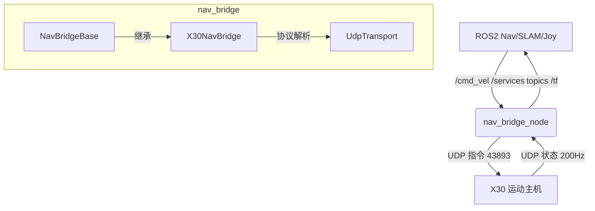

# Nav Bridge — ROS2 ↔ X30 机器狗 UDP 导航桥接节点

`nav_bridge` 是一个基于 C++ 编写的 ROS2 节点，充当**导航算法（如 Nav2、SLAM）与机器狗底层之间的桥梁**。它负责将 ROS2 的标准 `/cmd_vel` 速度指令以及服务调用，转换为机器狗底层识别的 UDP 协议报文（遵循 X30 UDP 规格书 V1.0.5），同时将机器狗高频上报的 IMU、足式里程计及状态数据转换为标准 ROS2 话题输出。

## 1. 架构概览

项目采用了清晰的**三层解耦架构**，以保证通信的实时性和代码的可移植性：
1. **纯网络层 (`UdpTransport`)**：最底层的纯 Linux Socket 封装，使用 `poll` 机制实现了带超时的非阻塞 UDP 收发。完全剥离 ROS 依赖环境，具备极强复用性。
2. **抽象网关层 (`NavBridgeBase`)**：负责声明所有 ROS2 相关的事务（订阅 `/cmd_vel`、创建动作控制服务、发布 `/odom` 和 `/imu` 话题等），并定义了一套标准的 C++ 虚函数作业契约，供子类对接协议。
3. **协议实现层 (`X30NavBridge` + `x30_protocol`)**：核心适配实现。继承基类虚函数，负责深层次的内嵌状态机博弈维护，并将基类的行为调用翻译、重组成遵循 12 字节表头/ 256 字节定长的 UDP 紧凑报文。



## 2. 核心状态机与控制逻辑 (核心竞争力)

本节点不仅仅做透传，还在内部实现了一套健壮的控制接管与状态确认逻辑，以应对机器狗执行各种动作时的安全性和连续性要求。

### 2.1 控制权接管 (`ensureControlTakeover`)

由于机器狗底层控制具有抢占优先级特性，节点如果在长时间静默后想让机器狗执行指令，必须**首先下发足量的心跳报文来夺取控制权**，才能确保后续指令立刻被执行。

1. **发送心跳与请求连接**：在冷启动（刚发起控制接管操作）时，节点会以 50ms 为间隔循环连续发送 50 次（共计 2.5 秒）的 `CMD_HEARTBEAT` (0x21040001) 心跳包，并附带一次 `CMD_QUERY_103` (0x21020001) 连接确认请求。这个长时间的预热是为了给底层程序预留充足的切换和注册接管源的时间。
2. **热保活确认**：如果系统自身记录表明当前控制权已经是活跃态（例如正在接受下方的平滑 /cmd_vel 控制），则只会快速补发 3 次（150ms）心跳用于热接管。
3. **内联心跳下发**：只有经过上述足够数量心跳建立的心跳池积攒，节点才正式下发动作和步态指令。由于动作服务多采用阻塞查询，为了防止此时由于 ROS2 Executor 单线程被阻塞导致控制权掉线，程序内部在阻塞查询基本状态转变的同时也会通过内联机制强行发包保活。

### 2.2 状态监测与阻塞等待 (`waitForBasicState` / `waitForGaitState`)

绝影的很多状态切换需要数秒的时间（如趴下→起立需要数秒）。为了给上层提供可靠的服务，节点实现了**阻塞轮询机制**：
- 当用户调用服务（如起立、趴下、切换步态等）时，节点先夺取控制权，下发命令。
- 进入 `while` 循环，每 50ms 轮询一次 `current_basic_state_` 或 `current_gait_state_` 是否达到期望值。
- 在阻塞轮询的同时，每 200ms 内联发送一次心跳，保持控制权不断。
- 达到期望状态或者超时（如 5s/8s），向用户返回结果。

### 2.3 Ready 一键就绪序列 (`/nav_bridge/ready`)

上层导航往往需要机器人处于可移动状态才能开始发 `/cmd_vel`。节点通过一个 `ready` 服务，将机器狗从任意状态（哪怕是软急停、摔倒、趴下）自动拉起到完全准备好在山地环境进行导航的状态：

1. **异常恢复 [0/4]**：检查是否在软急停 (`SOFT_ESTOP`)，若是，下发起立/趴下指令让其先恢复为趴下 (`LYING_DOWN`)。
2. **起立 [1/4]**：状态在趴下时，发送 `CMD_STAND_UP_DOWN`，并阻塞等待状态流转达 `INITIAL_STAND`。
3. **力控模式 [2/4]**：到达初始站立后，发送 `CMD_FORCE_CONTROL`，阻塞等待至 `FORCE_STAND`。
4. **山地步态与RL运动 [3/4]**：到达力控站立后，直接发送山地步态指令 `CMD_GAIT_MOUNTAIN`。机器人会自动流转到 `RL_MODE`（因为山地类的 RL 步态有其自己的运动态，不需要单独再发 CMD_MOTION）。最终确保系统落在 `RL_MODE` + `MOUNTAIN`，方可返回成功并开始接受全局速度指令。

### 2.4 安全趴下逻辑 (`/nav_bridge/lie_down`)

节点针对当前的杂乱状态（可能是前进中、可能是软急停）适配了各自安全的趴下方案：
- 若已在 `LYING_DOWN` 或 `GOING_DOWN`，直接返回或等待。
- 若处于 `SOFT_ESTOP`，发送趴下指令并等待直接恢复。
- 若处于运动中 (`STEPPING` 或 `RL_MODE`)，**必须先停止运动**，节点先发送趴下指令令其退回力控站立 (`FORCE_STAND`)。
- 当处于站立状态 (`INITIAL_STAND` 或 `FORCE_STAND`) 时，再次发送指令最终让其趴下 (`LYING_DOWN`)。

## 3. 速度下发流转 (/cmd_vel)

对于运动的平滑控制，数据流如下：

1. **接收目标速度**：`cmdVelCallback()` 缓存用户期望的 `vx`, `vy`, `vyaw`，并记录 `last_cmd_vel_time_`。
2. **超时机制**：如果在 `cmd_vel_timeout_ms_` (默认 500ms) 内未收到新的 `/cmd_vel`，速度自动归零，触发避险停车并释放控制权。
3. **主控 Timer**：`sendCmdVelTick()` 以设定的频率 (默认 50Hz) 运行：
   - 如果系统有效（`vx/vy/vyaw` 非0，或处于制动期），将夺取并维持控制权（接续心跳）。
   - **步态速度约束表**：查询内部通过高频线程更新保存的 `current_gait_state_`，并去结构体表中查找机器狗在当前步态下的理论最大线角速度限值。
   - **线性映射与滤死区**：`velocityToAxisValue()` 将目标速度按比例映射到 `[-32767, 32767]` 之间的摇杆轴指令。在这层映射转换中不仅做了阈值限幅，还额外处理了底层控制协议固有的死区过滤特性（所有小于 655 的摇杆数据强行归一截断为0，从而规避机器狗怠速漂移）。
   - 最后将三个向上的轴指令拆包并发送对应的前缀命令码： `CMD_VEL_FORWARD`, `CMD_VEL_LATERAL`, `CMD_VEL_YAW` UDP 包，完成**基于上层平滑速度曲线的“底层伪遥控器脉冲”驱动下发**。

## 4. 上传数据解析 (UDP -> ROS2)

由于 UDP 底层的高频刷写特性，节点在后台启动了一个独立的守护线程 `receiveLoop()`。该线程在底层 `std::thread` 中被阻塞挂起循环，通过 `poll` 提供 50ms 超时监测机制，无情地接收并提取 103 主机吐出的所有 200Hz 高频状态包：由于接发双端在不同线程进行交互处理，系统内部运用了 `std::mutex` 以及 `std::atomic` 对全局标志位进行强行锁住，以此保证所有动作确认博弈的安全判定。

- **`0x1008 RcsData` (200Hz)**：解析基础运行状态，主要用于监控底层反馈的各类错误特征位（电量低、电机及驱动器报错、IMU解算等安全错误），一旦异常通过系统层 `ROS_WARN/ERROR` 外抛预警。
- **`0x1009 MotionStateData` (200Hz)**：
  - 更新内部状态池：主要是更新 `current_basic_state_`，`current_gait_state_` 这对极其核心的高频态变量，专供 `/nav_bridge/ready` 等动作服务端的主轮询服务进行比对。
  - 发布到 ROS 话题：提供底层可视化的 `/robot_basic_state`, `/robot_gait_state`。
  - **解算并重构 Odom 数据结构**：原生获取的内部机器狗足底里程计存在结构定义以及坐标朝向差异；程序通过内部矩阵拆封，将底层原生位姿 (`x, y, yaw`) 与原生速度 (`vx, vy, vyaw`) 严格按照 ROS 规定的右手笛卡尔系重排转化，随后作为标准的 `nav_msgs/Odometry` 推送给订阅方；内部同样内嵌了向外推流 `odom -> base_link` tf静态/动态树的可选配置机制。
- **`0x100A ControllerSensorData` (200Hz)**：高频提取原始 `ImuSensorData`，进行角度到弧度的转换与底层缺失的四元数封装重建算位，并发布为标准的 `sensor_msgs/Imu` 数据流。
- **`0x21050F0A BatterySensorData` (0.5Hz)**：解析并低频发布电池剩余电量信息。

## 5. ROS2 接口详述

### 订阅的话题 (Subscribers)
* `/cmd_vel` (`geometry_msgs/Twist`): 控制机器狗平移和转向的统一速度接口。

### 发布的话题 (Publishers)
* `/imu/data` (`sensor_msgs/Imu`): 200Hz 高频底层 IMU 数据。
* `/leg_odom` (`nav_msgs/Odometry`): 200Hz 机器狗自身足底计算产生的内部里程计，可用作导航输入。
* `/robot_basic_state` (`std_msgs/Int32`): 实时上报当前的机器人基本状态（站立、趴下、软急停等）。
* `/robot_gait_state` (`std_msgs/Int32`): 实时上报机器狗当前步态（行走、山地、楼梯等）。
* `/battery/level` (`std_msgs/UInt8`): 电量百分比。

### 提供的服务 (Services)
这些服务底层被赋予了 `夺取控制权 -> 发指令 -> 阻塞验证状态并发送心跳 -> 重试重抛` 的闭环机制。
* `/nav_bridge/ready` (`std_srvs/Trigger`): 终极命令！将机器狗从任意状态自动恢复，直至调整至最高战备状态（RL模式+山地步态），即可开始接收速度。
* `/nav_bridge/stand_up_down` (`std_srvs/Trigger`): 简单触发起立与趴下的状态翻转。
* `/nav_bridge/force_stand` (`std_srvs/Trigger`): 令机器狗进入力控站立状态（松软站姿）。
* `/nav_bridge/lie_down` (`std_srvs/Trigger`): 绝对安全的退拽命令。从任意态安全优雅地回到平趴原始状态。
* `/nav_bridge/start_motion` (`std_srvs/Trigger`): 让**普通步态** (如常规行走) 进入 `STEPPING` 原地踏步运动状态。
* `/nav_bridge/stop_motion` (`std_srvs/Trigger`): 在 `STEPPING` 状态下停止运动退回力控站立。
* `/nav_bridge/mountain_gait` (`std_srvs/Trigger`): 快速指定切换为山地步态（RL_MODE）。
* `/nav_bridge/switch_gait` (`std_srvs/SetBool`): 已弃用或保留部分在 越障/行走 基础步态之间切换的需求。

## 6. 编译及运行

```bash
# 进入工作空间进行编译
colcon build --packages-select nav_bridge --cmake-args -DCMAKE_BUILD_TYPE=Release -Wno-dev -DCMAKE_EXPORT_COMPILE_COMMANDS=1 --symlink-install

# 环境变量激活
source install/setup.bash

# 通过 launch 脚本启动（加载内置 config/x30_params.yaml 配置）
ros2 launch nav_bridge nav_bridge.launch.py
```

## 7. 文件逻辑及组织结构

```
nav_bridge/
├── CMakeLists.txt
├── package.xml
├── README.md                      # 即本文档，项目及细节说明
├── config/
│   └── x30_params.yaml            # 参数配置（UDP 端口、心跳频率、tf使能等）
├── docs/
│   └── udp_manual.txt             # 绝影 X30 官方通信手册存档
├── launch/
│   └── nav_bridge.launch.py       # ROS2 引导启动脚本
├── include/nav_bridge/
│   ├── nav_bridge_base.hpp        # 抽象基类（定义标准 ROS 话题/发布/订阅/服务结构模型）
│   ├── udp_transport.hpp          # Linux BSD 面向 UDP Socket 标准封装（带基于 select / poll 的非阻塞与超时管理）
│   ├── x30_protocol.hpp           # 宏大且完整的 X30 协议头文件（常量映射、各传感器和状态机联编结构体、最大线角速度表等）
│   └── x30_nav_bridge.hpp         # 定义 `X30NavBridge` 派生子类（涉及业务逻辑字段，包括 nav_mode 原子锁跟踪）
└── src/
    ├── nav_bridge_node.cpp        # 节点注册点 `main()`, 构造节点参数器并调用 `X30NavBridge`
    ├── udp_transport.cpp          # UDP 传输收发代码实现
    └── x30_nav_bridge.cpp         # ※ 核心业务逻辑实现 (心跳及控制权轮询+状态机阻塞流转确认+服务逻辑+Twist到控制指令UDP报文打包的转换映射等)
```
