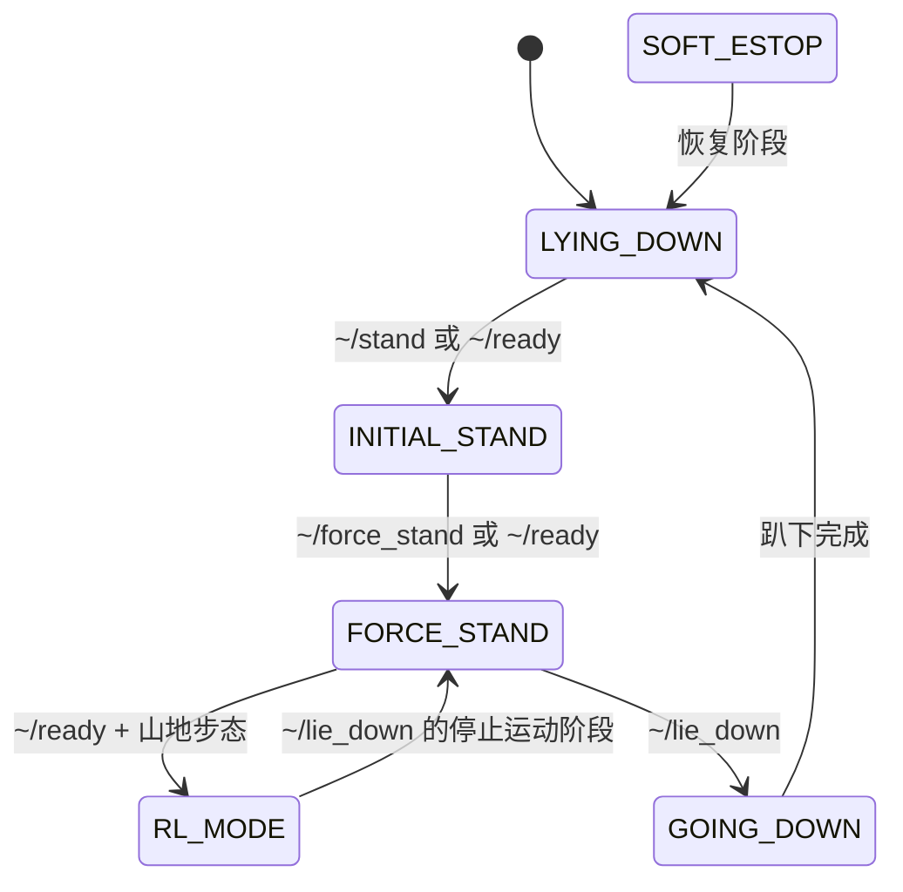

# Nav Bridge — ROS2 ↔ 绝影 X30 UDP 导航桥接节点

`nav_bridge` 是一个基于 C++ 的 ROS2 节点，用来把上层导航系统的标准接口桥接到绝影 X30 的 UDP 控制协议上。

它主要完成两件事：

1. 把 ROS2 的 `/cmd_vel` 与动作服务转换成 X30 底层可识别的 UDP 控制报文
2. 把机器人底层回传的高频状态、IMU、电池和足式里程计转换为标准 ROS2 话题

当前实现基于 `docs/udp_manual.txt` 中的 X30 UDP 接口规格，并针对实际控制接管时序做了额外的业务封装。

## 1. 当前架构

本项目现在不是一个“大类包办所有事情”的实现，而是按职责拆成了几层：

1. **网络层：`UdpTransport`**
   - 纯 Linux UDP socket 封装
   - 负责打开端口、发送报文、带超时接收
   - 不依赖 ROS2

2. **协议层：`x30_protocol.hpp`**
   - 定义 X30 指令码、状态枚举、结构体和速度映射工具
   - 包含 `CommandHead`、`RcsData`、`MotionStateData`、`ControllerSensorData`、`BatterySensorData`
   - 包含各步态的速度上限表

3. **状态仓库：`RobotStateStore`**
   - 统一保存当前连接状态、基本状态、步态状态
   - 提供基于 `condition_variable` 的状态等待能力
   - 替代旧版本里 scattered 的原子变量和轮询等待

4. **控制会话层：`ControlSessionManager`**
   - 统一管理控制接管、心跳、连接确认查询、超时释放
   - 区分冷启动会话与热会话
   - 给动作服务和 `/cmd_vel` 提供统一的控制保活机制

5. **动作执行层：`ActionExecutor`**
   - 封装 `stand`、`lie_down`、`force_stand`、`ready`
   - 负责冷启动接管预热、必要时的重复发令、状态等待和超时判定
   - 是当前所有动作业务逻辑的核心

6. **ROS 装配层：`X30NavBridge`**
   - 创建 ROS2 订阅、发布器、服务
   - 启动接收线程和控制定时器
   - 将底层状态转换为 ROS2 消息
   - 自己不再承担大段动作状态机逻辑

```mermaid
graph TD;
    A[ROS2 Nav / SLAM / Control] -->|/cmd_vel / services| B[X30NavBridge]
    B -->|topics / tf| A

    subgraph nav_bridge
        B --> C[ActionExecutor]
        B --> D[ControlSessionManager]
        B --> E[RobotStateStore]
        B --> F[UdpTransport]
        G[x30_protocol]
        C --> D
        C --> E
        B --> G
    end

    F -->|UDP 43893| H[X30 运动主机]
    H -->|状态上报| F
```



## 2. 核心控制逻辑

### 2.1 控制接管

X30 并不是“发一条动作指令就一定立刻执行”的设备。对于长时间静默后第一次发指令的场景，必须先建立稳定的控制会话。

当前实现中的控制接管逻辑如下：

- 控制会话由 `ControlSessionManager` 管理
- 会话活跃期间，统一控制定时器会持续发送：
  - `CMD_HEARTBEAT` (`0x21040001`)
  - 首次接管时附带 `CMD_QUERY_103` (`0x21020001`)
- `/cmd_vel` 和动作服务共享同一个控制会话
- 当一段时间没有控制活动后，会自动：
  - 发送零速度轴指令
  - 停止心跳
  - 释放控制权

### 2.2 冷启动与热启动

为了提高第一次动作指令的成功率，当前系统区分了两种接管场景：

- **冷启动接管**
  - 用于节点启动后第一次动作请求，或者控制会话长时间释放后的首次动作
  - 预热时间更长
  - 更适合 `ready` 的第一次起立

- **热会话接管**
  - 用于已经接管过机器人的后续动作
  - 预热时间更短
  - 用于力控切换、山地步态切换、趴下等流程

### 2.3 持续接管窗口

当前代码中，`ready` 的起立步骤和 `lie_down` 中的关键阶段不再简单依赖“一次发令 + 一次等待”。

对于容易受首次接管影响的动作，系统会进入一个**持续接管窗口**：

- 先做接管预热
- 发送一次控制命令
- 在一个总超时窗口内持续保活
- 若长时间仍无目标状态变化，则按固定间隔重发命令
- 直到出现目标状态或整体超时

这个机制是当前提高 `ready` 首次成功率的关键。

## 3. 主要服务语义

### 3.1 `~/ready`

`ready` 是当前最核心的业务服务，用于把机器人从静态或异常态拉到可导航工作态。

当前流程如下：

1. 如果在 `SOFT_ESTOP`，先恢复到 `LYING_DOWN`
2. 若在 `LYING_DOWN / GOING_DOWN`，执行起立
3. 若起立后处于 `INITIAL_STAND`，切入力控站立
4. 切换山地步态 `CMD_GAIT_MOUNTAIN`
5. 等待进入 `RL_MODE + MOUNTAIN`

成功后，机器人应当处于：

- 基本状态：`RL_MODE`
- 步态状态：`MOUNTAIN`

此时可以接受 `/cmd_vel` 导航速度输入。

### 3.2 `~/stand`

将机器人从趴下状态拉起到站立相关状态。

当前逻辑会：

- 若已经站立，直接返回成功
- 若处于软急停，先恢复到趴下
- 然后执行起立流程
- 等待进入 `INITIAL_STAND / FORCE_STAND / STEPPING`

### 3.3 `~/force_stand`

将机器人切换到力控站立状态。

当前逻辑会：

- 若已在 `FORCE_STAND`，直接返回
- 否则做一次热接管
- 发送 `CMD_FORCE_CONTROL`
- 等待进入 `FORCE_STAND`

### 3.4 `~/lie_down`

让机器人安全回到趴下状态。

当前策略比旧版本更保守，按业务场景分段处理：

- 若已经趴下，直接成功
- 若正在趴下，只等待最终进入 `LYING_DOWN`
- 若处于软急停，先恢复趴下
- 若处于 `RL_MODE / STEPPING`，先执行“停止运动”阶段回到 `FORCE_STAND / INITIAL_STAND`
- 然后再执行最终趴下阶段

`lie_down` 当前也复用了持续接管窗口，以提高冷启动或控制刚释放后再次服务调用的稳定性。

## 4. `/cmd_vel` 速度控制

`/cmd_vel` 并不会直接在回调里发 UDP，而是走统一控制定时器。

数据流如下：

1. `cmdVelCallback()` 缓存最新的 `vx / vy / vyaw`
2. `onControlInputUpdated()` 通知 `ControlSessionManager` 有新的控制活动
3. 统一控制定时器按固定频率运行
4. 若控制会话活跃：
   - 发送心跳和连接确认查询
   - 将速度映射为轴值
   - 发送三条轴控制指令
5. 若控制超时：
   - 发送零速度
   - 停止心跳
   - 释放控制权

### 4.1 速度映射

当前速度映射基于 `x30_protocol.hpp` 中的步态速度上限表：

- 前进速度：依据当前步态的 `max_forward / max_backward`
- 侧移速度：依据 `max_lateral`
- 角速度：依据 `max_yaw`

之后通过 `velocityToAxisValue()` 映射到 `[-32767, 32767]`。

额外处理：

- 速度超限时自动限幅
- 小于底层死区阈值时强制归零
- 侧移和偏航会根据 ROS 坐标系与 X30 遥杆定义差异进行符号变换

## 5. 上行数据解析

当前节点在后台启动一个接收线程 `receiveLoop()`，持续从运动主机接收状态上报。

主要处理以下报文：

- **`0x1008 RcsData`**
  - 机器人运行状态
  - 用于日志打印和错误告警
  - 首次收到时打印机器人名称、控制模式、累计里程与运行时间

- **`0x1009 MotionStateData`**
  - 当前最关键的状态反馈
  - 更新 `RobotStateStore`
  - 更新内部 `RobotState`
  - 发布 `/robot_basic_state` 与 `/robot_gait_state`
  - 发布 `/leg_odom`
  - 可选发布 `odom -> base_link` TF

- **`0x100A ControllerSensorData`**
  - 解析 IMU 欧拉角、角速度、加速度
  - 转换为标准 `sensor_msgs/Imu`
  - 发布 `/imu/data`

- **`0x21050F0A BatterySensorData`**
  - 发布电池电量百分比 `/battery/level`

## 6. 当前 ROS2 接口

### 6.1 订阅的话题

- `/cmd_vel` (`geometry_msgs/msg/Twist`)
  - 标准速度控制接口

### 6.2 发布的话题

- `/imu/data` (`sensor_msgs/msg/Imu`)
- `/leg_odom` (`nav_msgs/msg/Odometry`)
- `/robot_basic_state` (`std_msgs/msg/Int32`)
- `/robot_gait_state` (`std_msgs/msg/Int32`)
- `/battery/level` (`std_msgs/msg/UInt8`)

### 6.3 提供的服务

- `~/stand` (`std_srvs/srv/Trigger`)
- `~/lie_down` (`std_srvs/srv/Trigger`)
- `~/force_stand` (`std_srvs/srv/Trigger`)
- `~/ready` (`std_srvs/srv/Trigger`)

说明：

- 旧版本里存在的 `motion` 服务链路已移除
- 当前业务上不再暴露独立的“开始运动/停止运动”服务接口
- `ready` 进入山地步态后，机器人会根据底层状态机进入 `RL_MODE`

## 7. 配置参数

默认参数位于 `config/x30_params.yaml`。

主要参数包括：

- `motion_host_ip`
- `motion_host_port`
- `local_recv_port`
- `heartbeat_interval_ms`
- `cmd_vel_rate_hz`
- `cmd_vel_timeout_ms`
- `imu_frame_id`
- `odom_frame_id`
- `base_frame_id`
- `publish_tf`

## 8. 编译与运行

```bash
colcon build --packages-select nav_bridge --cmake-args -DCMAKE_BUILD_TYPE=Release -Wno-dev -DCMAKE_EXPORT_COMPILE_COMMANDS=1 --symlink-install

source install/setup.bash

ros2 launch nav_bridge nav_bridge.launch.py
```

## 9. 目录结构

```text
nav_bridge/
├── CMakeLists.txt
├── package.xml
├── README.md
├── config/
│   └── x30_params.yaml
├── docs/
│   └── udp_manual.txt
├── launch/
│   └── nav_bridge.launch.py
├── include/nav_bridge/
│   ├── action_executor.hpp
│   ├── control_session_manager.hpp
│   ├── nav_bridge_base.hpp
│   ├── robot_state_store.hpp
│   ├── udp_transport.hpp
│   ├── x30_nav_bridge.hpp
│   └── x30_protocol.hpp
└── src/
    ├── action_executor.cpp
    ├── nav_bridge_node.cpp
    ├── udp_transport.cpp
    └── x30_nav_bridge.cpp
```

## 10. 当前实现特点

相较于项目早期版本，当前实现的几个显著特点是：

- 状态等待已改为事件驱动，而不是显式轮询 sleep
- 心跳与速度发送统一到同一个控制时基
- 动作状态机从节点类中拆出，集中到 `ActionExecutor`
- 冷启动接管、热会话接管和服务动作逻辑已显式建模
- `README` 以当前代码为准，不再描述已经删除或废弃的旧行为

## 11. 服务状态流转

下面这张图描述的是当前最常用的几个服务在业务层面的主要状态流转。



如果按 `ready` 的完整顺序理解，可以简化为：

`SOFT_ESTOP/LYING_DOWN -> INITIAL_STAND -> FORCE_STAND -> RL_MODE + MOUNTAIN`

如果按 `lie_down` 的完整顺序理解，可以简化为：

`RL_MODE/STEPPING -> FORCE_STAND -> GOING_DOWN -> LYING_DOWN`

## 12. 实机调试建议

当前实现已经能在实机上工作，但从控制时序角度，仍然建议按下面的方式调试和使用：

- 第一次上电或节点刚启动后，优先先执行一次 `~/ready`
- 如果刚释放控制权又立刻调用动作服务，允许系统先完成接管预热，不要连续高频猛点服务
- `~/lie_down` 在 `RL_MODE` 下会先经历“停止运动”阶段，再进入真正趴下阶段，这属于正常流程
- `/cmd_vel` 长时间静默后再次接管时，系统会自动重新建立控制会话
- 若日志中看到“保持接管并继续重发命令”，说明系统正在处理冷启动接管较慢的情况，不一定代表逻辑故障

建议的最小回归顺序：

1. 启动节点，确认已收到状态包
2. 调用一次 `~/ready`
3. 在 `RL_MODE + MOUNTAIN` 下发送少量 `/cmd_vel`
4. 停止 `/cmd_vel`，确认控制会话自动释放
5. 调用 `~/lie_down`

如果现场需要分析问题，最值得重点观察的日志关键词包括：

- `心跳已启动, 并已发送连接确认查询`
- `控制会话激活`
- `保持接管并继续重发命令`
- `基本状态: ... -> ...`
- `步态: ... -> ...`

## 13. 已知实现边界

当前版本有一些明确的工程边界，文档里也一并说明：

- 当前只桥接运动主机 `192.168.1.103:43893`，`percept_udp_` 仍未接入业务流程
- 控制接管依然是工程策略，不是依赖底层显式 ack
- 冷启动首次接管的时序比热会话更敏感，因此动作执行器中保留了分阶段保活与重发机制
- 机器人名称字段当前常见为空字符串，这不影响主控制链路
- 接收线程可能看到一部分未处理指令码，只要核心状态包正常即可先不视为故障

## 14. 速查表

### 14.1 服务

| 服务名 | 类型 | 作用 |
| --- | --- | --- |
| `~/stand` | `std_srvs/srv/Trigger` | 从趴下拉起到站立相关状态 |
| `~/lie_down` | `std_srvs/srv/Trigger` | 安全退回趴下状态 |
| `~/force_stand` | `std_srvs/srv/Trigger` | 切入力控站立 |
| `~/ready` | `std_srvs/srv/Trigger` | 一键进入 `RL_MODE + MOUNTAIN` |

### 14.2 订阅话题

| 话题名 | 类型 | 说明 |
| --- | --- | --- |
| `/cmd_vel` | `geometry_msgs/msg/Twist` | 线速度与角速度控制输入 |

### 14.3 发布话题

| 话题名 | 类型 | 说明 |
| --- | --- | --- |
| `/imu/data` | `sensor_msgs/msg/Imu` | IMU 数据 |
| `/leg_odom` | `nav_msgs/msg/Odometry` | 足式里程计 |
| `/robot_basic_state` | `std_msgs/msg/Int32` | 基本状态码 |
| `/robot_gait_state` | `std_msgs/msg/Int32` | 步态状态码 |
| `/battery/level` | `std_msgs/msg/UInt8` | 电池百分比 |

### 14.4 关键参数

| 参数名 | 默认值 | 说明 |
| --- | --- | --- |
| `motion_host_ip` | `192.168.1.103` | 运动主机 IP |
| `motion_host_port` | `43893` | 运动主机端口 |
| `local_recv_port` | `43897` | 本地 UDP 绑定端口 |
| `heartbeat_interval_ms` | `200` | 心跳发送周期 |
| `cmd_vel_rate_hz` | `50` | 速度轴指令发送频率 |
| `cmd_vel_timeout_ms` | `5000` | `/cmd_vel` 控制超时 |
| `imu_frame_id` | `imu_link` | IMU frame |
| `odom_frame_id` | `odom` | 里程计 frame |
| `base_frame_id` | `base_link` | 机器人本体 frame |
| `publish_tf` | `false` | 是否发布 `odom -> base_link` TF |
